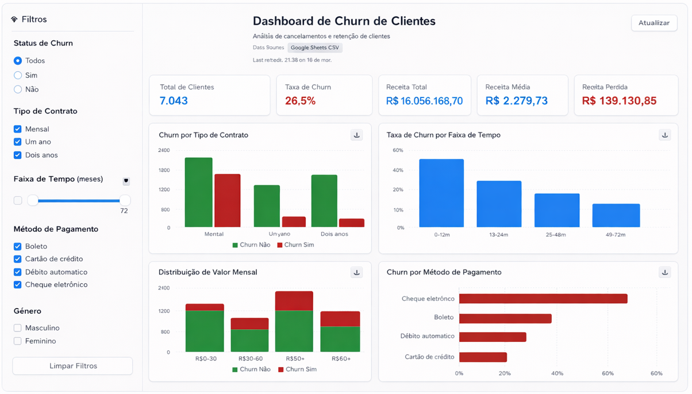

# 🤖 AI Data Copilot + Dashboard de Churn (Telecom)

Plataforma de análise de dados com **dashboard interativo** e **AI Data Copilot**, utilizando **LLMs, Agents e RAG** para geração automática de insights e suporte à tomada de decisão.

---

## 🚀 Visão Geral

Este projeto simula um cenário real de negócio focado em **análise de churn de clientes no setor de telecomunicações**, combinando:

- 📊 Visualização de dados (Dashboard interativo)
- 🧠 Geração de insights com IA (LLM + Agents)
- 🔎 Contextualização com RAG (Retrieval-Augmented Generation)

O objetivo é demonstrar como integrar **BI + IA** para criar soluções modernas de análise de dados.

---

## 📊 Preview do Dashboard

  

---

## 📊 Dashboard

O dashboard foi desenvolvido com base nos dados tratados e estruturados, utilizando **apoio de ferramentas de IA (Replit)** para acelerar a construção da interface.

🔗 **Acesse o dashboard:**
- https://workspacechurn-dashboard-production.up.railway.app/

🔗 **Versão inicial (Replit):**
- https://b90be4c4-970a-4140-ab69-8459bfb8d618-00-3h6b71i09oqlk.janeway.replit.dev/

---

## 📂 Fonte de Dados

Dataset público de churn (telecom):

🔗 Kaggle:  
https://www.kaggle.com/datasets/blastchar/telco-customer-churn

🔗 Google Sheets (fonte ativa do projeto):  
https://docs.google.com/spreadsheets/d/1W9_d6wi9x7CB5z0Rx0km7LmiOvfW_laW2ywFSAy2QRU/export?format=csv  

📌 *Optei por utilizar o Google Sheets como fonte de dados para permitir atualizações contínuas da base, possibilitando que o projeto reflita automaticamente novas informações sem necessidade de reprocessamento manual.*

---

## 🧠 AI Data Copilot (Chatbot)

Foi desenvolvido um chatbot inteligente capaz de:

- 💬 Interpretar perguntas em linguagem natural  
- 📊 Gerar insights automaticamente com base nos dados  
- 🔎 Utilizar RAG para recuperar contexto relevante  
- ⚙️ Orquestrar respostas com Agents  

---

## 🧰 Tecnologias Utilizadas

- Python (pandas, numpy)
- SQL
- Power BI / Dashboard Web
- LLMs (OpenAI)
- LangChain (Agents, Tools)
- FAISS (Vector Store)
- RAG (Retrieval-Augmented Generation)
- Replit (AI-assisted development)
- Railway (deploy e hospedagem do dashboard)

---

## 🧩 Arquitetura do Projeto

O projeto é dividido em três camadas principais:

1. **Dados**
   - Ingestão e tratamento (CSV → DataFrame)
   - Análise exploratória (EDA)

2. **Dashboard**
   - Construção de visualizações interativas
   - Interface para análise de KPIs

3. **IA (Copilot)**
   - LLM para interpretação de perguntas
   - Agents para execução de tarefas
   - RAG para enriquecimento de contexto

---

## 🎯 Principais Análises

- Taxa de churn
- Perfil de clientes que cancelam
- Impacto de variáveis (contrato, pagamento, serviços)
- Segmentação de clientes
- Indicadores de retenção

---

## 💡 Diferenciais do Projeto

- Integração de **BI + IA**
- Uso de **LLMs aplicados a dados reais**
- Simulação de ambiente corporativo
- Dashboard criado com **apoio de IA (Replit)**
- Chatbot analítico para geração de insights
- Atualização automática da base via Google Sheets

---

## 📌 Objetivo

Demonstrar na prática como utilizar **LLMs, Agents e RAG** para transformar dados em **insights acionáveis**, além de explorar a **automatização da criação de dashboards com apoio de IA**.

---

## 👤 Autor

**Lucas Diagone**

🔗 LinkedIn:  
https://www.linkedin.com/in/lucas-diagone-691285104/

🔗 GitHub:  
https://github.com/LucasDiagone

